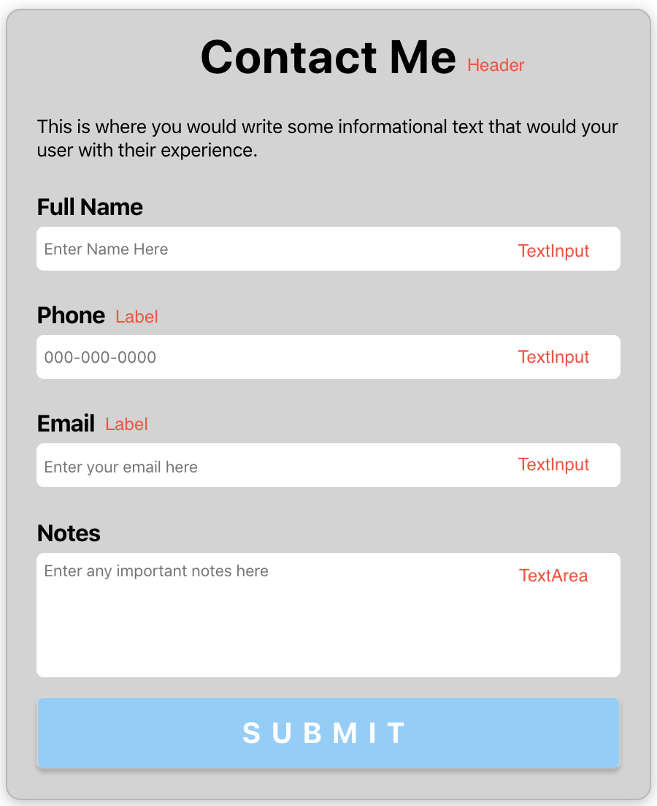

# Contact Form Component

### Step 1: Download & Place in Your Components folder

Download the repo. After you have downloaded the folder. Add the ContactForm folder into your components project folder.

### Step 2: Import

The next step is to import the ContactForm component within your project. At the top of your specified file please copy and paste.

`import ContactForm from "./ContactForm/ContactForm.js"`

Wherever you would like to use the component, please call on the component using

`<ContactForm />`

You are now using the component. Congratulations.

### Step 3: Form field Customization

The greate thing about this component is it's Atomic Design. Everyone usually asks for something different so we built this component just for that. Within `ContactForm` folder, we have several
other components we'd like to refer to as "Atoms". Each with it's own unique properties to give you that level of customization you're dying to have. These other component files are as follows:

`Header.js`

`Label.js`

`TextArea.js`

`TextInput.js`

The components in the current form labeled:

### Header Component & Props

Within the `ContactForm.js` you can edit the `name` and `instruction` prop apart of `Header` component. The `name` prop edits the title and `instruction` prop edits the subtext underneath.

`<Header name="Contact Me" instruction="This is where you would write some informational text that would your user with their experience." >`

### Label Component & Props

Within the `ContactForm.js` you can edit the `name` prop apart of the `Label` component. The `name` prop edits the label title.

`<Label name="Edit this to change label title" />`

### TextInput Component & props

Within the `ContactForm.js` you can edit the `type` & `placeholder` prop apart of the `TextInput` component. The `type` prop edits input type and `placeholder` will change what's displayed.

`<TextInput type="email" placeholder="Enter your email here" />`

### TextArea Component & props

Within the `ContactForm.js` you can edit the `placeholder` prop apart of the `TextArea` component. The `placeholder` will change what's displayed. The text area component is a larger text input.

`<TextArea placeholder="Enter any important notes here" />`
